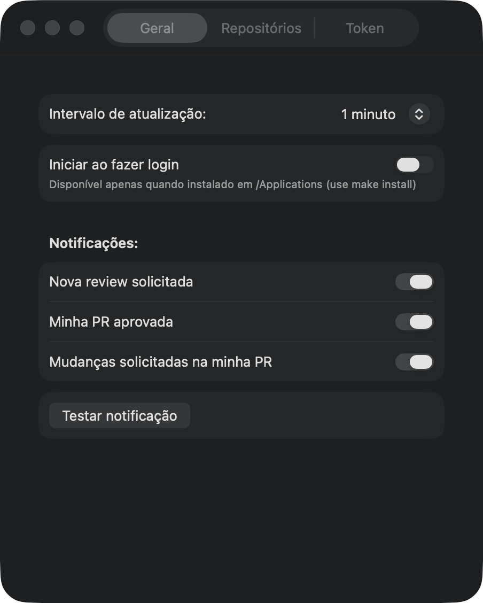

# GitMeter

Aplicação de menu bar para macOS que monitora Pull Requests do GitHub em tempo real.


## O que ele mostra

GitMeter exibe um badge na barra de menus com a contagem de PRs aguardando sua revisão. Ao clicar no ícone, você vê um painel com quatro seções principais — todas colapsáveis:

- **Aguardando minha review** — PRs onde você foi solicitado como revisor (exclui rascunhos)
- **Respondidas por mim** — PRs que você já aprovou ou pediu alterações
- **Comentadas por mim** — PRs onde você deixou comentários sem aprovar/pedir mudanças (recolhida por padrão)
- **Minhas PRs** — suas PRs abertas, com contadores de status (aprovadas, alterações solicitadas, aguardando, rascunhos)

Cada linha de PR mostra:

- Avatar, número e título da PR
- **Status**: ícone de relógio (aguardando), checkmark verde (aprovada), X laranja (mudanças solicitadas), bolha (comentário)
- **CI**: ícone de status da pipeline (passou ✓, falhou ✗, rodando ⏱)
- **Diff**: +adições −deleções (verde/vermelho)
- **Threads**: contadores de comentários abertos/resolvidos com avisos de "+" se ultrapassar limites
- **Conflito**: chip laranja "conflito" se houver merge conflict
- **Sem CodeRabbit**: chip laranja se nenhum revisor automatizado tocou a PR (exclui rascunhos)
- **Rascunho**: tag "Rascunho" se for draft
- **Equipe**: hint "equipe" se há revisores de time solicitados e você não está na lista
- **Hora relativa**: tempo desde a última atualização (agora, há 5min, há 2h, há 3d)

Agregado **CodeRabbit**: linha por repositório mostrando quantas PRs foram tocadas pelo revisor automatizado (`coderabbitai`).

**Menu de contexto** em cada linha (clique direito):
- Abrir no navegador
- Copiar URL
- Copiar branch (desabilitado se não disponível)
- Abrir arquivos alterados

**Atalhos de teclado** (painel aberto):
- **⌘R** — atualizar imediatamente
- **Esc** — fechar painel

**Notificações** (banner com som):
- Nova review solicitada em uma PR
- Sua PR foi aprovada
- Mudanças solicitadas na sua PR

Notificações podem ser **retroativas** (até 48h): o app preserva um snapshot do último poll e dispara eventos para mudanças que ocorreram enquanto estava fechado.



## Instalação

### Via Homebrew (recomendado)

```bash
brew install --cask --no-quarantine MarcosFabriciio/tap/gitmeter
```

**Por que `--no-quarantine`?**

GitMeter é assinado com assinatura ad-hoc (não notarizado pela Apple). O macOS por padrão bloqueia apps com esse tipo de assinatura via Gatekeeper. O flag `--no-quarantine` remove essa restrição. Alternativa: `xattr -dr com.apple.quarantine /Applications/GitMeter.app` após instalar sem o flag.

### Do código-fonte

Requisitos:
- **macOS 14.0+**
- **Xcode completo** (não apenas Command Line Tools)
- **Homebrew** (para instalar xcodegen na primeira execução)

```bash
make install
```

Compila em Release, move para `/Applications/GitMeter.app` e abre. O `make` instala `xcodegen` automaticamente na primeira vez.

### Desenvolvimento

```bash
make run      # Abre o app em Debug (xcodegen auto)
make test     # Roda testes sem UI
make build    # Compila Debug sem abrir
```

## Configuração

1. Clique no ícone na barra de menus
2. Clique na engrenagem (canto inferior direito) para abrir **Ajustes**
3. **Aba Repositórios**:
   - Digite repositórios no formato `owner/repo` (ex: `vercel/next.js`)
   - Adicione quantos quiser
4. **Aba Token**:
   - Por padrão, usa `gh auth token` (você já deve ter rodado `gh auth login`)
   - Opcionalmente, cole um PAT (escopo `repo`) para sobrescrever
   - O app busca nesta ordem: PAT do Keychain → `gh auth token`
5. **Aba Geral**:
   - Configure o intervalo de polling (30s, 1m, 2m, 5m) — padrão 60s
   - Ative notificações (todas ativas por padrão)
   - Configure iniciar ao fazer login (só funciona se instalado em `/Applications`)
   - Botão "Testar notificação" para verificar

## Como funciona

GitMeter faz polling da API GraphQL do GitHub a cada intervalo configurado. Cada repositório gera **uma requisição GraphQL independente** — elas rodam em paralelo para minimizar latência.

**Estimativa de taxa**: ~2–3 pontos de rate-limit por poll por repo (vs. 5000 pontos/hora disponíveis).

**Backoff inteligente**:
- Se todos os repos falharem, delay dobra (max 10min)
- Se qualquer repo retornar rate-limit, respeta o `Retry-After` do servidor
- Se pontos restantes < 500, delay dobra (proteção extra)

**Snapshot persistido**: o app salva uma foto dos últimos dados em `~/Library/Application Support/com.marcosfabriciio.GitMeter/snapshot.json`. Na próxima abertura, notificações retroativas são disparadas para eventos ocorridos até 48h atrás. Snapshots mais antigos são descartados silenciosamente.

**Refresh ao acordar**: quando o Mac sai do sleep, o app força um poll imediato.

**Dados stale em falha**: se um repo falhar em uma requisição, o app mantém os últimos dados conhecidos (não limpa a seção).

## Desenvolvimento

```
Sources/
├── GitMeterApp.swift      — @main, MenuBarExtra + janela de Settings
├── Models.swift           — tipos de domínio (RepoConfig, PullRequest, Summary, etc.)
├── Derivation.swift       — lógica pura: classify, summarize, notificationEvents
├── GitHubClient.swift     — DTOs GraphQL, decodificação, transporte HTTP
├── TokenProvider.swift    — Keychain PAT → gh CLI; cache em memória
├── PRStore.swift          — loop de polling, diff, backoff, wake-from-sleep
├── SettingsStore.swift    — UserDefaults + SMAppService
├── Notifier.swift         — UNUserNotificationCenter
└── Views/
    ├── PopoverView.swift  — seções, rows, footer, atalhos
    └── SettingsView.swift — abas Geral / Repositórios / Token

Tests/
├── DerivationTests.swift  — 40+ testes de classificação
├── DiffTests.swift        — testes de notificação (transições)
├── DecodingTests.swift    — fixture → DTO → domain
└── Fixtures/sample.json

Scripts/
└── generate_icon.swift    — gera AppIcon a partir de um PNG de base
```

**Stack**: Swift 6 / SwiftUI, MenuBarExtra, XcodeGen — **zero dependências externas**.

**Testes**: 61 testes com Swift Testing, sem rede, rodados por CI.

**Source de verdade**: `project.yml` (XcodeGen) — não editar `.xcodeproj` manualmente.

## Release

Tags `v*` disparam um GitHub Actions workflow que:
1. Compila e testa
2. Zipa o `.app` e gera SHA256
3. Publica um GitHub Release com o zip
4. (Quando `TAP_GITHUB_TOKEN` está configurado) Atualiza a cask no Homebrew tap

```bash
git tag v0.1.0
git push origin v0.1.0
```

## Limitações (v1)

- **Team review requests**: PRs com revisores de time solicitados aparecem apenas como hint "equipe" na linha. Não contam como pendência na sua conta.
- **Caps visíveis**:
  - 50 PRs por repositório (excepto com aviso)
  - 100 threads por PR (excepto com aviso "+")
- **Snapshot retroativo**: notificações para eventos que ocorreram até 48h antes do último fechamento. Além disso, o primeiro poll vira o novo baseline silenciosamente.
- **Apenas github.com** — sem suporte a GitHub Enterprise Server.
- **Ad-hoc signing**: builds de desenvolvimento pedem permissão de notificação novamente; instale via `make install` como padrão.

## Licença

MIT — `Copyright (c) 2026 Marcos Fabricio`
